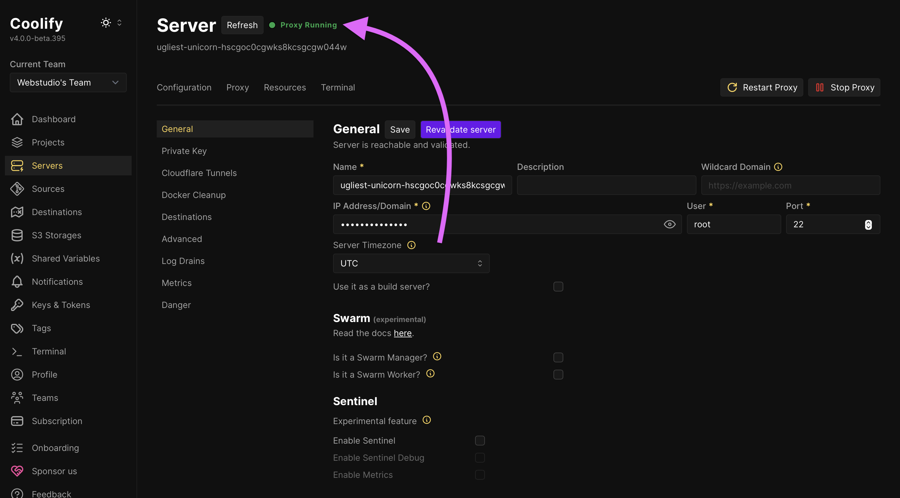
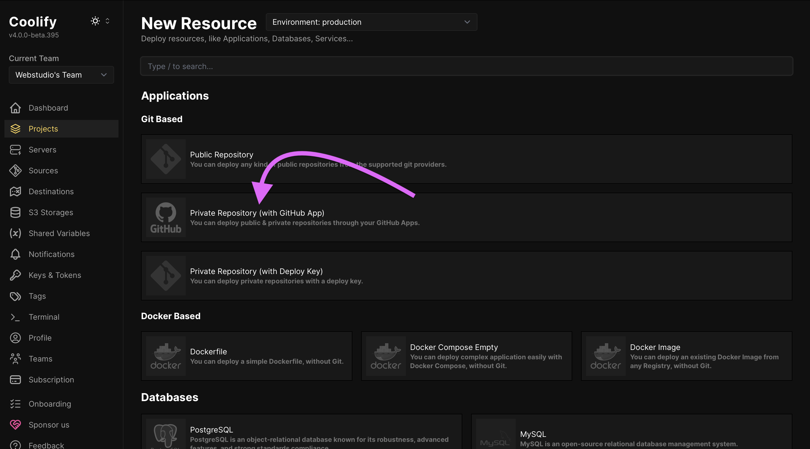
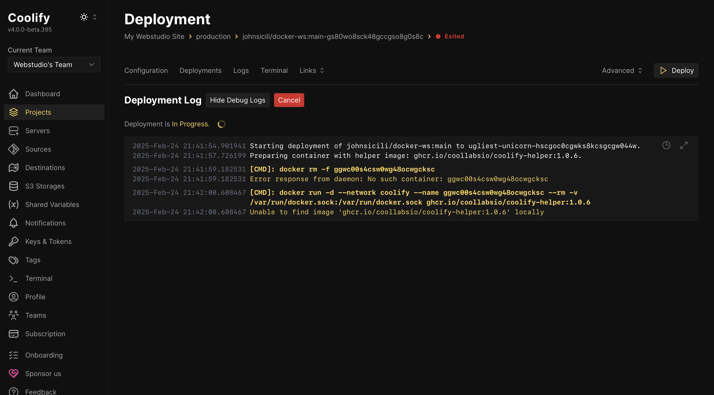

# ▶️ Hetzner with Coolify (Docker)

In this tutorial, you will learn how to export your Webstudio Project and use [Coolify](https://coolify.io) to deploy it to [Hetzner](https://www.hetzner.com).


Coolify is a PaaS that makes it easy to deploy and manage applications on your own server, giving you control over your infrastructure without the complexity. You can self-host Coolify or use their Cloud.




## Prerequisites

* [GitHub account](https://github.com)
* [Hetzner account](https://www.hetzner.com)
* [Webstudio CLI](cli.md)

## 1. Create a GitHub repository

Create a repository where you will add the Webstudio Project code in the following steps.

Be sure to clone the repository to your local machine.

## 2. Export Webstudio Project

Use the [CLI](cli.md) to export your Project and select the "Docker" option.

## 3. Push to GitHub

Now that the site code is local, push it to GitHub.


You do not need to install dependencies.


## 4. Setup Hetzner Server

1. Create a new server.
2. Select your preferred region.
3. Select the Ubuntu image with a [version that is supported by Docker](https://docs.docker.com/engine/install/ubuntu/#os-requirements).
4. Select the type; a shared CPU is sufficient and the minimum recommended RAM is 2 GB.
5. Add an IPv4.
6. All other defaults suffice, though you can optionally modify them.
7. Click "Create and Buy Now". Wait as your server is provisioned then copy the IPv4 address.

## 5. Configure Coolify to use your server

1. Create a Coolify account or log in to your existing account.
2. Navigate to the "Servers" tab.
3. Add a new server and provide your server’s IP address then click “Continue”.
4.  Click “Validate Server & Install Docker Engine“ and Coolify will install all necessary components on your server automatically. Once completed, you should see a green “Proxy Running” status.

    

## 6. Setup a Project on Coolify

1. Go to Projects and create a new one.
2. Add a Resource to the project.
3.  Select the source of your code, likely a private repository.

    
4. Add a GitHub app and provide it access to your repository with the site.
5.  Change the Build Pack to Dockerfile.

    
6.  Click Deploy and wait several minutes while it deploys. You can click “Show debug logs” to see more details.

    
7. If all goes well, you should see “Deployment is Finished.”
   1. If the deployment fails, one possibility is that the server does not have enough resources.
8. (Optional) If you are loading images from third-party domains, add them to your environment variables with the key `DOMAINS` and a comma-separated list of the third-party domains.
9.  At the top, there is a "links" button which will take you to the live site.

    

## 7. Sync, build, and push new changes

When you are ready to publish your latest changes again, follow these steps:

1. Click "Publish" in the builder (even though you aren't publishing to the cloud, it's necessary to generate the latest build data).
2. Run `webstudio sync`
3. Run `webstudio build --template docker`
4. Push the changes to GitHub

Coolify will automatically detect the changes and trigger a new deployment.

<figure><figcaption></figcaption></figure>

***

Now, you should have a website built on Webstudio that is hosted on Hetzner using Coolify, giving you full control over your infrastructure.
